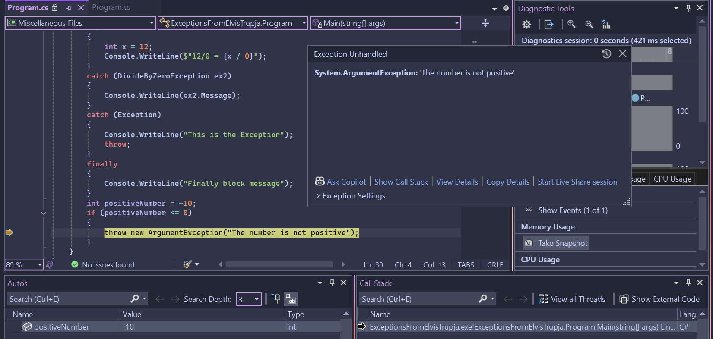
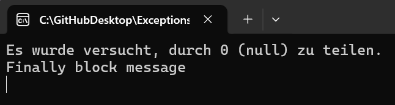

# Exception Handling in C# – Example Project

This project demonstrates how exception handling works in C#. It shows the use of `try`, `catch`, `finally`, and how to manually throw exceptions such as `ArgumentException`.

## 📸 Screenshots

